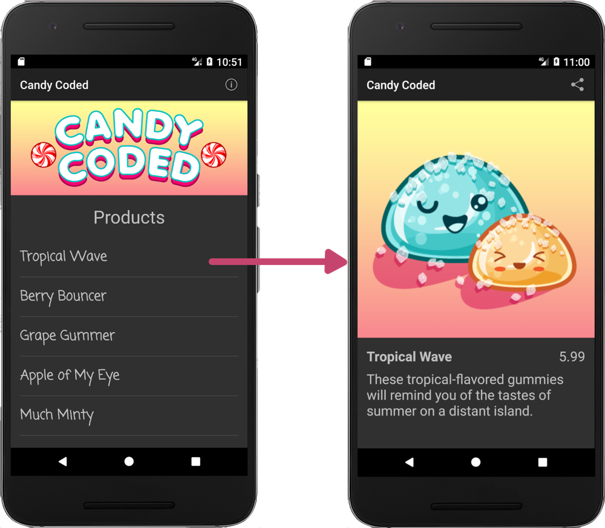
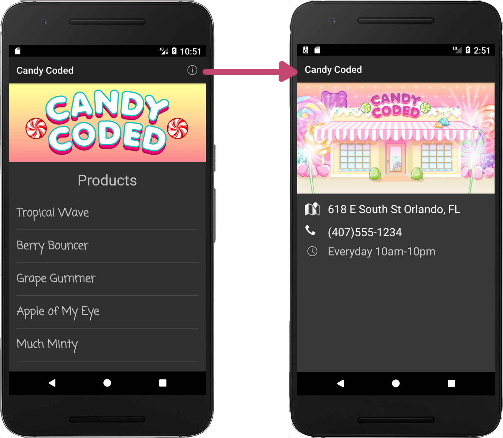
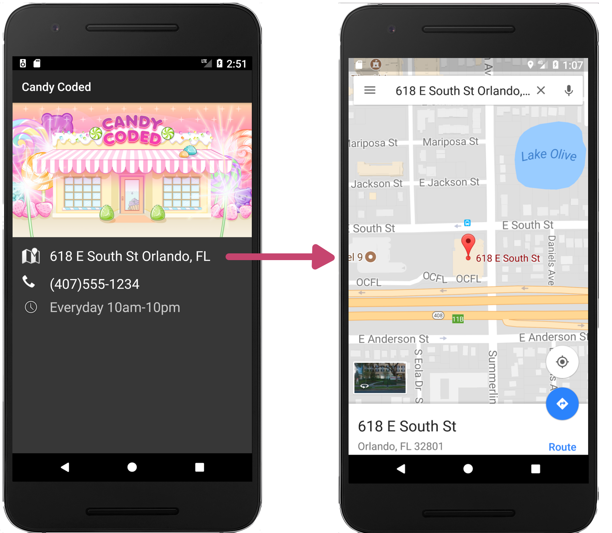
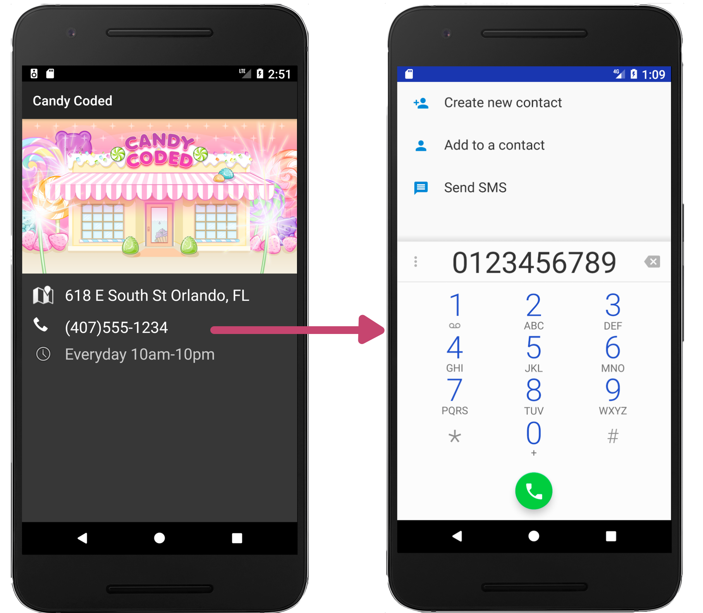
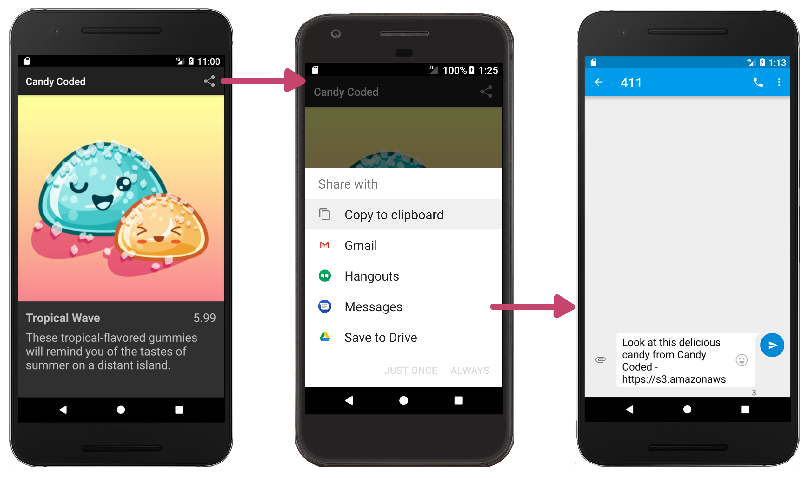

#  Pluralsight Project: Adding Implicit and Explicit Intents to an Android Candy Store App

This repo contains the code for the Pluralsight Project "Add Implicit and Explicit Intents to an Android Candy Store App," located here: https://app.pluralsight.com/projects/add-implicit-and-explicit-intents-to-an-android-candy-store-app/

